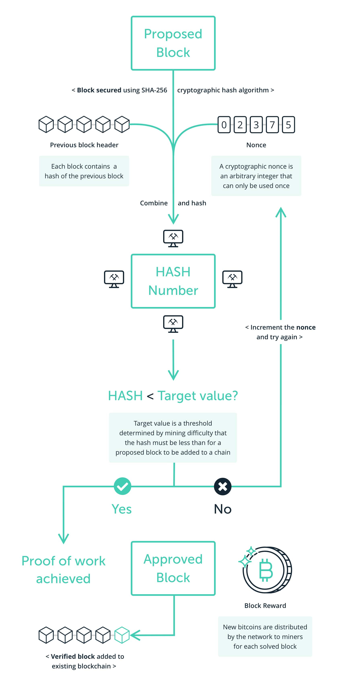
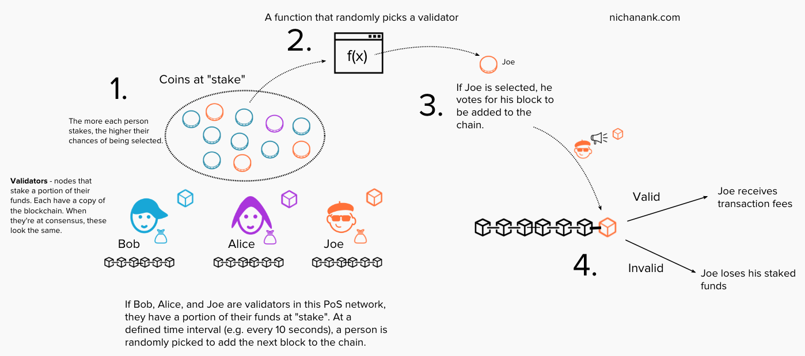
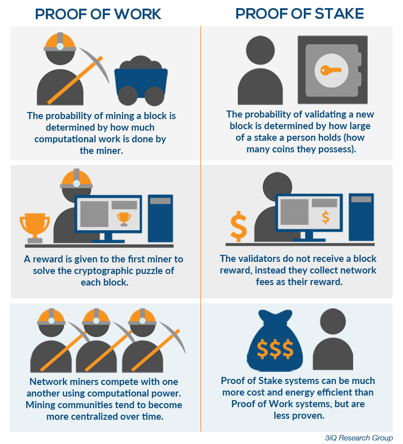
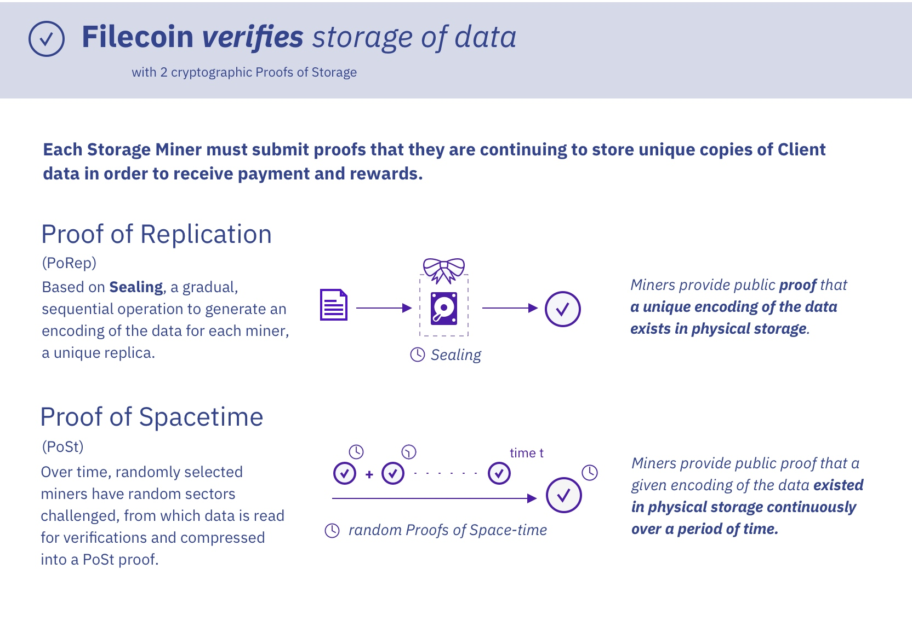

# Crypto-101
## Introduction
A breakdown of various topics in blockchain.

# Consensus mechanisms used by major layer 1's
## Proof of Work

#### High energy consumption

  PoW networks pay for its security with energy. The more energy spent on maintaining the network, the more secure it is. Miners are competitive and are economically driven to find the most efficient means of retrieving energy, which arguably drives demand for sustainable methods of energy production - turning to renewable resources for example.

#### Highly secure and censorship-resistant

As PoW blockchains grow, each block becomes exponentially more tamper-proof with age.

#### Miner centralization

Economies of scale in mining operations means that if you have 100x more money, you might get 1000x more leverage/upside by mass-producing hardware and gain more hashing power - the relationship between hashpower and voting power is exponential.

### Proof of Stake
Proof-of-stake networks do not rely on miners. Instead, they have validators whose voting power is proportional to the amount of cryptocurrency they "stake" on the network. What this means is that instead of using computational power, they lock up their funds as a deposit for a chance to add new blocks. The higher their stake, the higher the chances of being selected. If they are selected and the transactions they're proposing are valid, they receive the transaction fees for that block (in most cases there are no block rewards in a PoS system). 

#### No economies of scale

- 100x more funds at stake means a 100x higher chance of being selected - system still favors those who already have significant capital

- The more someone stakes, the more money they risk losing, they are also illiquidating their own capital - the relationship between economic stake and voting power is linear

#### Attacks are very expensive and impractical

To carry out a 51% attack would mean buying 51% of all the available tokens and then potentially have all of this stake slashed

##  Proof-of-Stake vs Proof-of-Work

Less expensive, energy efficient than PoW - as security does not depend on hashing power, there is no "arms race" to get the best hardware

## [Delegated Proof-of-Stake](https://www.nichanank.com/blog/2018/6/4/consensus-algorithms-pos-dpos)
DPoS uses reputation systems and real-time voting to elect a panel of witnesses, who take turns adding new blocks. At every t time interval (e.g. every 10 minutes), the list of witnesses reshuffles and they take turns adding blocks again according to the new ordering

## Proof of Space Time (PoSt) and Proof of Replication (PoRep)

Filecoin's consensus protocol elects a miner to create a block, and the probability of a miner being selected is proportional to its currently used storage relative to the rest of the network. Thus, this consensus protocol ensures that the amount of storage provided is also used as proof of computation.

## Proof of Authority
Proof-of-authority (PoA) is an alternative consensus mechanism, which relies on known and reputable validators to produce blocks, and thus, provide computational power to a network. It enables relatively faster transactions using a Byzantine Fault Tolerance (BFT) algorithm with identity as a stake. 

PoA is a type of consensus mechanism geared towards enterprises or private organizations who want to build their own chains that are essentially closed in nature and don’t require participation from general users. E.G. HyperLedger Fabric

## Proof of History
Instead of trusting the timestamp on the transaction, you could prove that the transaction occurred sometime before and after an event. The Proof of History is a high frequency Verifiable Delay Function. A Verifiable Delay Function requires a specific number of sequential steps to evaluate, yet produces a unique output that can be efficiently and publicly verified.

Proof of History is a sequence of computation that can provide a way to cryptographically verify passage of time between two events. It uses a cryptographically secure function written so that output cannot be predicted from the input, and must be completely executed to generate the output. The function is run in a sequence on a single core, its previous output as the current input, periodically recording the current output, and how many times its been called. The output can then be re-computed and verified by external computers in parallel by checking each sequence segment on a separate core. Data can be timestamped into this sequence by appending the data (or a hash of some data) into the state of the function. The recording of the state, index and data as it was appended into the sequences provides a timestamp that can guarantee that the data was created sometime before the next hash was generated in the sequence. This design also supports horizontal scaling as multiple generators can synchronize amongst each other by mixing their state into each others sequences.
